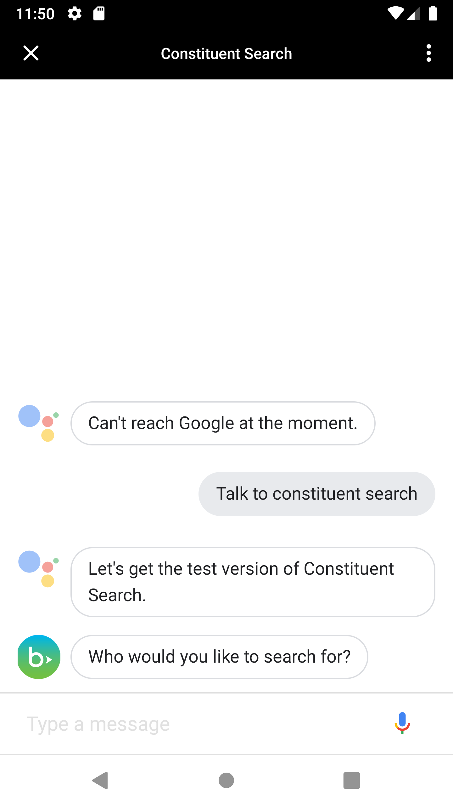
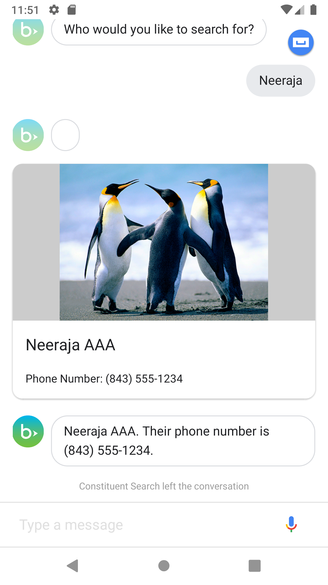
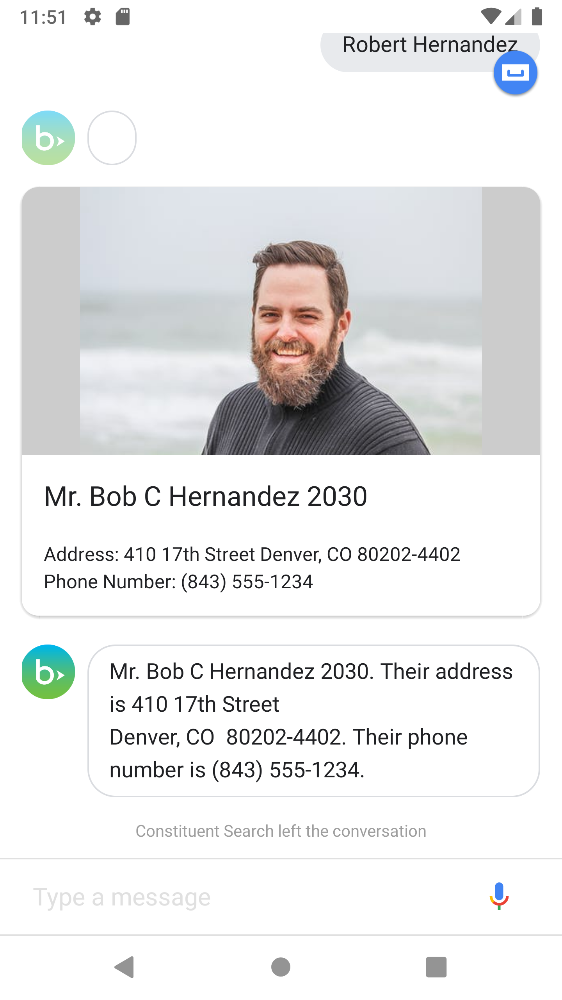

# skyapi-android-voice-skill-hello-world

This repository contains the code for an app that demonstrates how to use the Android
Assistant with Blackbaud SKY. This is exploratory and I encountered some limitations with
what is currently possible.

Author: [Steven Draugel](https://github.com/sdraugel)

## What it has/does

1. An Android Assistant agent that looks up a constituent by name - this displays a view with the profile picture, display name, address and phone number.

<p align="center">
     
    <p align="center">
        <i>Kick off the constituent search agent</i>
     </p>
</p>

<p align="center">
     
    <p align="center">
        <i>Response from the agent after searching using a single name</i>
    </p>
</p>


<p align="center">
     
    <p align="center">
        <i>Response from the agent after searching using a full name</i>
    </p>
</p> 

### Included unused code

I experimented with other available fullfillments and found that the implementation
of these pieces were not needed.

#### The Agent

I created an agent using Google's dialog flow and trained it to:
1. Open a conversation with a user asks the assistant to `talk to constituent search`
1. Ask for constituent's name that the user would like to search for
1. Respond to single name responses
1. Respond to full name responses

## Additions wanted (contributions welcome)

1. Greater conversation flexibility which allow for more fluid agent interactions 
1. Figure out a way to authenticate with SKY Api.
1. Format visual responses using SKY UX styling
1. Unit tests
1. Localization
1. Accessibility

## Getting started

Prerequisites:
* VSCode - Recommended IDE
* Firebase Account
* Node.js
* A SKY Developer account with environment access is needed to access data in SKY API
* A SKY application

1. Set up your SKY application
    1. Go to [SKY Developer](https://developer.blackbaud.com/apps/) and create an application
    1. Add the application to an environment
        1. Go to the home page of environment where you are an environment admin
        1. Go to Control Panel > Applications
        1. Click Add Application
        1. Enter your Application ID and click Save
1. Get your auth code and subscription key:
    1. Go to the SKI Api endpoint you are wanting to use and look for Blackbaud OAuth 2.0 Service. 
    1. Select Authorization code and follow the prompts. 
    1. Note the Authorization code and Subscription key
1. Create a file called [access-keys.xml](./functions/access-keys.json.xml), set the following properties:
    ```json
    {
        "sky_api_subscription_key": "Bearer <your auth code>",
        "sky_api_access_token": "<your subscription key>"
    }
    ```
        * Note that these keys are intended to be kept secrect and should not be included in a production release.

### Debugging

1. Open the Firebase console, select Functions, and select your function. Here you'll be able to see all the logs from your webhook.

## Usage

This is licensed under the MIT License. Please feel free to use this app as a starting
point for your own app that is available to Blackbaud clients. Keep in mind that there
are separate limitations on using Blackbaud's logo, name, and other trademarks as
part of your App Store metadata as per Apple's and Blackbaud's terms of service.

This repository contains a proof of concept and, while it can be used as the basic for your own app,
you should review it for security best practices prior to publication. For example,
for ease of debugging, secrets and stack traces are printed to the console, which
should never be done in a production application.

#### Secrets

For simplicity, this app communicates directly with SKY API using the SKY application secret
and subscription key. These values should never be exposed in a front end application. Instead,
you should have a secure server that makes SKY API requests, and the app should communicate
with that server.

#### OAuth

SKY OAuth has not been implementd yet. You will need to generate a new access token every hour while developing.

#### To Deploy Service
1. run `firebase deploy --only functions`.
1. Ensure that your device is logged into the same account that firebase is.